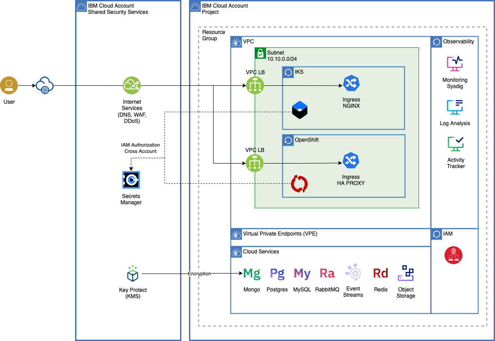

# IBM Cloud Native Reference Architectures

## Container as a Service Reference Architecture

Architecture Diagram
Download [drawio](ibmcloud-vpc-iks-architecture.drawio) file.

## Observability Reference Architecture

Observability Architecture Diagram
Download [drawio](ibmcloud-observability.drawio) file.

## Secrets Manager Reference Architecture

Single Secrets Manager instance shared across Clusters and Accounts Architecture Diagram. Download [drawio](ibmcloud-iks-secrets-manager.drawio) file.

## PaaS

* [Internet Services](https://cloud.ibm.com/catalog/services/internet-services)
* [Secrets Manager](https://cloud.ibm.com/catalog/services/secrets-manager)
* [Key Protect](https://cloud.ibm.com/catalog/services/key-protect)
* [Container Registry](https://cloud.ibm.com/kubernetes/catalog/registry)
* [Continuous Delivery](https://cloud.ibm.com/catalog/services/continuous-delivery)
* [Schematics](https://cloud.ibm.com/schematics)
* [IBM Cloud Monitoring](https://cloud.ibm.com/catalog/services/ibm-cloud-monitoring)
* [IBM Log Analysis](https://cloud.ibm.com/catalog/services/logdna)
* [IBM Cloud Activity Tracker](https://cloud.ibm.com/catalog/services/logdnaat)
* [Mongo](https://cloud.ibm.com/catalog/services/databases-for-mongodb)
* [Redis](https://cloud.ibm.com/catalog/services/databases-for-redis)
* [Postgres](https://cloud.ibm.com/catalog/services/databases-for-postgresql)
* [Cloud Object Storage](https://cloud.ibm.com/catalog/services/cloud-object-storage)

## CaaS

* [IKS (IBM Cloud Kubernetes Service)](https://cloud.ibm.com/kubernetes/catalog/create)
* [Red Hat OpenShift on IBM Cloud](https://cloud.ibm.com/kubernetes/catalog/create?platformType=openshift&newCreate=true)

## IaaS

* [VPC](https://cloud.ibm.com/vpc-ext/network/vpcs)
* [VPC Subnets](https://cloud.ibm.com/vpc-ext/network/subnets) 
* [VPC Public Gateways](https://cloud.ibm.com/vpc-ext/network/publicGateways)
* [VPC VPN Gateways](https://cloud.ibm.com/vpc/provision/vpngateway)
* [VPC Load Balancer](https://cloud.ibm.com/vpc/provision/loadBalancer)
