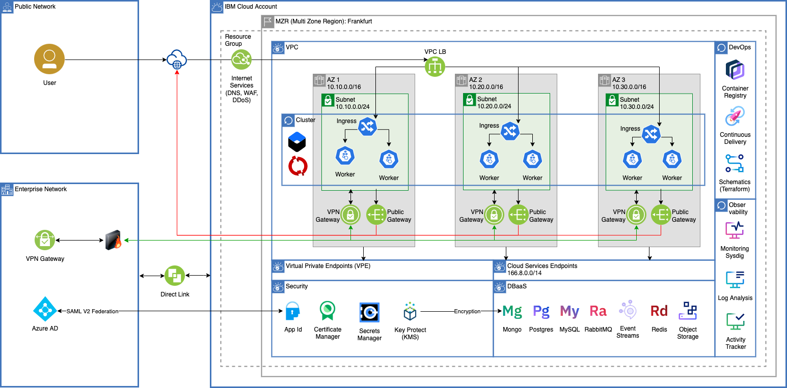

Cloud Native Reference Architecture with Cloud Services

PaaS
* [Internet Services](https://cloud.ibm.com/catalog/services/internet-services)
* [Certificate Manager](https://cloud.ibm.com/catalog/services/certificate-manager)
* [Key Protect](https://cloud.ibm.com/catalog/services/key-protect)
* [Container Registry](https://cloud.ibm.com/kubernetes/catalog/registry)
* [Continuous Delivery](https://cloud.ibm.com/catalog/services/continuous-delivery)
* [Schematics](https://cloud.ibm.com/schematics)
* [Monitoring with Sysdig](https://cloud.ibm.com/catalog/services/ibm-cloud-monitoring-with-sysdig)
* [Log Analysis with LogDNA](https://cloud.ibm.com/catalog/services/ibm-log-analysis-with-logdna)
* [Activity Tracker with LogDNA](https://cloud.ibm.com/catalog/services/ibm-cloud-activity-tracker-with-logdna)
* [Mongo](https://cloud.ibm.com/catalog/services/databases-for-mongodb)
* [Redis](https://cloud.ibm.com/catalog/services/databases-for-redis)
* [Postgres](https://cloud.ibm.com/catalog/services/databases-for-postgresql)
* [Cloud Object Storage](https://cloud.ibm.com/catalog/services/cloud-object-storage)

CaaS
* [IKS(IBM Cloud Kubernetes Service)](https://cloud.ibm.com/kubernetes/catalog/create)
* [Red Hat OpenShift on IBM Cloud](https://cloud.ibm.com/kubernetes/catalog/create?platformType=openshift&newCreate=true)

Iaas
* [VPC](https://cloud.ibm.com/vpc-ext/network/vpcs)
* [VPC Subnets](https://cloud.ibm.com/vpc-ext/network/subnets) 
* [VPC Public Gateways](https://cloud.ibm.com/vpc-ext/network/publicGateways)
* [VPC VPN Gateways](https://cloud.ibm.com/vpc/provision/vpngateway)
* [VPC Load Balancer](https://cloud.ibm.com/vpc/provision/loadBalancer)

