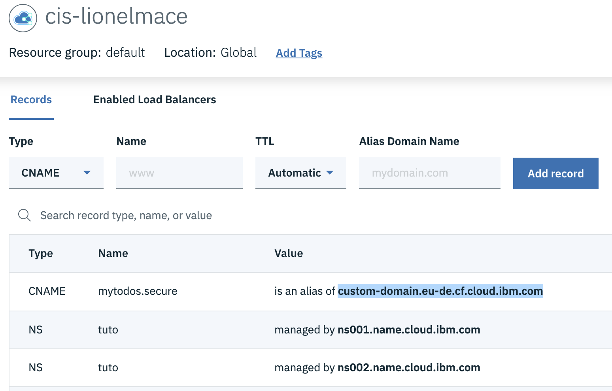

Certificate to be used in Cloud Foundry

## Generate a server certificate that will be presented by the Cloud Foundry Server

1. Install **Let's Encrypt**
    ```
    brew install letsencrypt
    ```

1. Generate a signed certificate for **secure.lionelmace.com**
    ```
    sudo certbot certonly --manual --preferred-challenges=dns --server https://acme-v02.api.letsencrypt.org/directory -d '*.secure.lionelmace.com'
    ```

1. Check the generate certificates
    ```
    sudo ls /etc/letsencrypt/live/secure.lionelmace.com/
    ```
    Output:
    ```
    README		cert.pem	chain.pem	fullchain.pem	privkey.pem
    ```

1. Copy the certificate and key in a Read directory to be able to load them from Cloud Foundry
    ```
    sudo cp /etc/letsencrypt/live/secure.lionelmace.com/fullchain.pem mydemo/certificate/.
    sudo cp /etc/letsencrypt/live/secure.lionelmace.com/privkey.pem mydemo/certificate/.
    chmod 644 fullchain.pem
    chmod 644 privkey.pem
    ```

## Create a custom domain in Cloud Foundry and upload the certificate

1. Go to the **Domains** of Cloud Foundry org [https://cloud.ibm.com/account/cloud-foundry](https://cloud.ibm.com/account/cloud-foundry)

1. Add the domain **secure.lionelmace.com**

1. Update the certificate **fullchain.pem** and **privkey.pem**

## Add a route for the custom domain to your CF application

1. Edit the route of your CF App and add the following route
    ```
    mytodos.secure.lionelmace.com
    ```
    

## Configure the DNS CNAME to route your domain name to Bluemix

1. Go to your service instance of Go to the **CIS (Cloud Internet Services)**

1. Add a DNS CNAME
    ```
    Type: CNAME 
    Name: mytodos.secure
    TTL : Automatic
    Alias Domain Name: custom-domain.eu-de.cf.cloud.ibm.com
    ```

    

1. Go back to Cloud Foundry and test the new route.

## Generate a client certificate with OpenSSL

1. Generate a new 2048 bit private key and a self signed certificate that will be used for the client certificate
    ```
    openssl req -newkey rsa:2048 -nodes -keyout clientPrivate.key -x509 \
   -days 365 -out clientPublic.crt \
   -subj "/C=UK/O=Example Corporation/CN=Mace's Sample API"
   ```

1. Generate a "p12" file containing both the public certificate and private key, which will be used by API Connect
    ```
    openssl pkcs12 -inkey clientPrivate.key -in clientPublic.crt -export -out clientCert.p12
    ```
    >Enter your chosen Export Password (eg "clientP4ssphr4se")

1. Delete the unprotected private key
    ```
    rm clientPrivate.key
    ```

# API Connect

## Create a new API in API Connect with TLS Profile

1. Go to this [tutorial](https://developer.ibm.com/apiconnect/2016/07/06/securing-apic-bm-app-mutual-tls/#step2a)

# Resources
* [Securing the connection from API Connect to a Bluemix application with mutual TLS authentication](https://developer.ibm.com/apiconnect/2016/07/06/securing-apic-bm-app-mutual-tls/)
* [Redirecting HTTP to HTTPS with Node.js & Express on IBM Bluemix](https://www.tonyerwin.com/2014/09/redirecting-http-to-https-with-nodejs.html)
* [Let's encrypt](https://certbot.eff.org/lets-encrypt/osx-other)