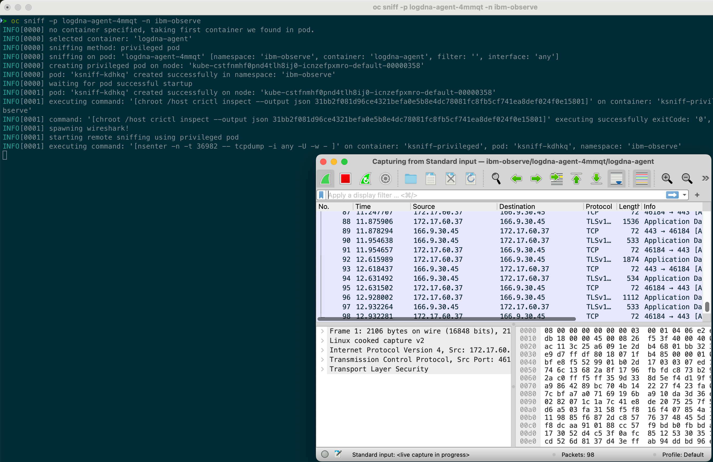

# Analysing network traffic with tcpdump and ksniff in ROKS

In this tutorial, we will see how to run **tcpdump** from a ROKS worker node and how to run packet captures with the tool **ksniff** inside Kubernetes Pods.

- [Connect to the cluster](#connect-to-the-cluster)
- [Run tcpdump from a worker node](#run-tcpdump-from-a-worker-node)
- [Packet capture inside Pod using ksniff](#packet-capture-inside-pod-using-ksniff)
- [Resources](#resources)

## Connect to the cluster

1. List the cluster to find the cluster id

    ```sh
    ibmcloud ks cluster ls
    ```

    Output:

    ```sh
    OK
    Name              ID                     State      Created          Workers   Location    Version                  Resource Group Name   Provider
    icn-zefpxm-roks   cstfnmhf0pnd4tlh8ij0   normal     43 minutes ago   3         Frankfurt   4.16.19_1543_openshift   icn-zefpxm-group      vpc-gen2
    ```

2. Connect to cluster as administrator

    ```sh
    ibmcloud ks cluster config -c cstfnmhf0pnd4tlh8ij0 --admin
    ```

    Output:

    ```sh
    OK
    The configuration for cstfnmhf0pnd4tlh8ij0 was downloaded successfully.

    Added context for cstfnmhf0pnd4tlh8ij0 to the current kubeconfig file.
    You can now execute 'kubectl' commands against your cluster. For example, run 'kubectl get nodes'.
    ```

## Run tcpdump from a worker node

To get host access to worker nodes for debugging and troubleshooting purposes, use the **oc debug node** command to deploy a pod with a privileged securityContext to a worker node that you want to troubleshoot.

> You can't access your worker node by using an SSH connection. SSH by password is unavailable on the worker nodes.

The oc debug command schedule a pod on the selected node where the main container mounts the host file system on the /host directory. After scheduling the pod, a shell into the main container is provided.

1. List the worker nodes

    ```sh
    oc get nodes
    ```

    Output

    ```sh
    NAME                                                     STATUS   ROLES           AGE   VERSION
    kube-cstfnmhf0pnd4tlh8ij0-icnzefpxmro-default-0000016b   Ready    master,worker   18m   v1.29.8+632b078
    kube-cstfnmhf0pnd4tlh8ij0-icnzefpxmro-default-00000298   Ready    master,worker   18m   v1.29.8+632b078
    kube-cstfnmhf0pnd4tlh8ij0-icnzefpxmro-default-00000358   Ready    master,worker   18m   v1.29.8+632b078
    ```

1. Start a debug container in one of the worker node

    ```sh
    oc debug node/kube-cstfnmhf0pnd4tlh8ij0-icnzefpxmro-default-0000016b
    ```

    Output

    ```sh
    Starting pod/kube-cstfnmhf0pnd4tlh8ij0-icnzefpxmro-default-0000016b-debug ...
    To use host binaries, run `chroot /host`
    Pod IP: 10.243.128.14
    If you don't see a command prompt, try pressing enter.
    sh-5.1# chroot /host]
    ```

1. Run tcpdump

    ```sh
    sh-5.1# tcpdump
    dropped privs to tcpdump
    tcpdump: verbose output suppressed, use -v[v]... for full protocol decode
    listening on ens3, link-type EN10MB (Ethernet), snapshot length 262144 bytes
    09:43:41.283403 IP kube-cstfnmhf0pnd4tlh8ij0-icnzefpxmro-default-0000016b.10250 > 10.243.0.15.36640: Flags [P.], seq 2529229626:2529229682, ack 1604586093, win 128, options [nop,nop,TS val 4171478034 ecr 2951140905], length 56
    09:43:41.283468 IP kube-cstfnmhf0pnd4tlh8ij0-icnzefpxmro-default-0000016b.10250 > 10.243.0.15.36640: Flags [P.], seq 56:239, ack 1, win 128, options [nop,nop,TS val 4171478034 ecr 2951140905], length 183
    09:43:41.284254 IP 10.243.0.15.36640 > kube-cstfnmhf0pnd4tlh8ij0-icnzefpxmro-default-0000016b.10250: Flags [.], ack 56, win 1007, options [nop,nop,TS val 2951140926 ecr 4171478034], length 0
    09:43:41.284255 IP 10.243.0.15.36640 > kube-cstfnmhf0pnd4tlh8ij0-icnzefpxmro-default-0000016b.10250: Flags [.], ack 239, win 1007, options [nop,nop,TS val 2951140926 ecr 4171478034], length 0
    09:43:41.353869 IP 10.243.128.13.30371 > kube-cstfnmhf0pnd4tlh8ij0-icnzefpxmro-default-0000016b.34109: Flags [P.], seq 1738171949:1738172079, ack 2514377068, win 1578, options [nop,nop,TS val 381811480 ecr 649675979], length 130
    ```

## Packet capture inside Pod using ksniff

ksniff is a popular tool for conveniently running packet captures inside Kubernetes Pods.

Pre-Requisites

* [ksniff](https://github.com/eldadru/ksniff)
* [wireshark](https://www.wireshark.org)

1. Get the pod id

    ```sh
    oc get pods
    ```

2. Run oc sniff

    ```sh
    oc sniff -p <POD-ID>
    ```

    

    > If you face this issue `Error: exec: "wireshark": executable file not found in $PATH`, follow these instructions [to add Wireshar in the PATH on MacOS](https://github.com/eldadru/ksniff/issues/88#issuecomment-742255680)

## Resources

* [Running tcpdump inside an OpenShift pod to capture network traffic](https://access.redhat.com/solutions/4569211s)
* [Packet capture inside Pod using community ksniff with OpenShift 4](https://access.redhat.com/articles/5436111)
* [Why can't I SSH into my worker node?](https://cloud.ibm.com/docs/openshift?topic=openshift-cs_ssh_worker)