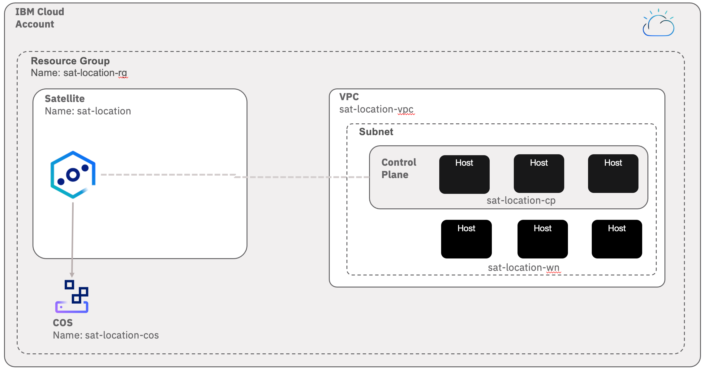

# Satellite demo

This shell script will prepare for you a Satellite demo environment. 
It will create all the resources below. All those resources will be created with the prefix **sat**.



* A Resource Group
* A VPC with one Subnet and its Public Gateway
* A Satellite location
* 6 VSIs in VPC
* Assign 3 hosts for the location control plane.

> The script does not provision the OpenShift cluster in the location.

## Pre Requisites

1. Install [IBM Cloud CLI](https://github.com/IBM-Cloud/ibm-cloud-cli-release/releases)

1. Install VPC Infrastructure plugin
    ```
    ibmcloud plugin install infrastructure-service
    ```

1. Install COS Plugin
    ```
    ibmcloud plugin install cloud-object-storage
    ```

1. Install [jq](https://stedolan.github.io/jq/download/) - command line JSON processor

## How to run it?

> Approximate Duration time: 10-12 mins

1. Launch a terminal.

1. Connection to IBM Cloud
    ```
    ibmcloud login
    ```

1. Clone this repo
    ```
    git clone https://github.com/lionelmace/ibmcloud-utils/
    ```

1. Go to directory satellite
    ```
    cd ibmcloud-utils/satellite
    ```

1. Copy the environnement variables
    ```
    cp satellite.env.template satellite.env
    ```

1. Set your location name in lower case
    ```
    export SATELLITE_LOCATION_NAME=your_location_name
    ```
    > This is optional if you have set the location name in the satellite.env. Othwerise, this will override the location name

1. Run the script
    ```
    ./satellite-create.sh
    ```
    > Once the script is complete, the Location will be fully available (Status: Normal) 30-40 minutes later.

## Clean up to avoid costs

> Approximate Duration time: 3 mins

1. Run the script
    ```
    ./satellite-remove.sh
    ```
