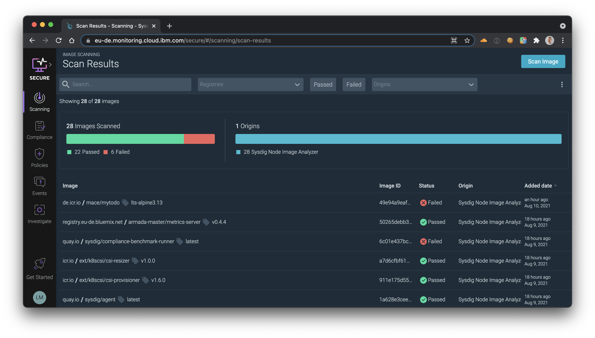

# Install Node Image Analyser in Sysdig Secure



1. Apply the config map for Sysdig Image Analyzer to the cluster.

    ```sh
    kubectl apply -f sysdig-image-analyzer-configmap.yaml -n ibm-observe
    ```

1. Apply the config map for the Sysdig Host Analyzer to the cluster.

    ```sh
    kubectl apply -f sysdig-host-analyzer-configmap.yaml -n ibm-observe
    ```

1. Apply the config map for the Sysdig Benchmark Runner to the cluster.

    ```sh
    kubectl apply -f sysdig-benchmark-runner-configmap.yaml -n ibm-observe
    ```

1. Apply the daemonset to deploy the Node Analyzer agent to the cluster.

    ```sh
    kubectl apply -f sysdig-node-analyzer-daemonset.yaml -n ibm-observe
    ```

1. At this point, the Node Image analyzer pods should be starting. You can run the following command to confirm the pods are running:

    ```sh
    kubectl get pods -n ibm-observe
    ```

    You should see 3 containers (3/3) running for Sysdig Node Analyzer:

    ```sh
    NAME                         READY   STATUS    RESTARTS   AGE
    logdna-agent-bhrt5           1/1     Running   0          21h
    logdna-agent-bxwb5           1/1     Running   0          21h
    sysdig-agent-gcmh9           1/1     Running   0          21h
    sysdig-agent-hsj75           1/1     Running   0          21h
    sysdig-node-analyzer-8rgc9   3/3     Running   0          19m
    sysdig-node-analyzer-tqff7   3/3     Running   0          19m
    ```

## Debug

1. View logs of the Sysdig Node Analyzer

    ```sh
    kubectl logs -n ibm-observe -c sysdig-host-analyzer sysdig-node-analyzer-8rgc9
    ```

1. View logs of the Sysdig Image Analyzer

    ```sh
    kubectl logs sysdig-node-analyzer-8rgc9 -n ibm-observe -c sysdig-image-analyzer
    ```

    You should see the analyzer running:

    ```sh
    {"level":"info","time":"2021-08-10T08:33:22Z","message":"Converted containerd image &{de.icr.io/mace/mytodo:lts-alpine3.13 sha256:3acea0c4dff85cb7fd2b19bc64b26408cf8c0cb007b8e227c384d09c858f51b1 49e94a9eaf11c7efbb601e8b854548cc83714968931e6f959e511807143f71ca unix:///var/run/containerd/containerd.sock 113780315 containerd}, running analyzer"}
    ```

## Resources

* [Deploying a monitoring agent in a standard Kubernetes cluster manually](https://cloud.ibm.com/docs/monitoring?topic=monitoring-config_agent#config_agent_kube_manually)
