# Install Openshift Data Foundation on Satellite based ROKS Clusters on VMWare

## Introduction

We would like to deploy OpenShift Data Foundation Add-on to our Satellite based OpenShift Cluster on VMWare using local disks. The procedure contains the following major steps

* Configuration of a VMWare storage configuration for our location and assign to our ROKS Cluster
* Deploy ODF using Satellite ODF storage configuration referencing Storage class

This lab assumes you already have an OpenShift cluster deployed in your Satellite location.

## Create a storage worker pool in the cluster

> Duration: 20 - 30 min

The VMWare Infrastructure still have hosts dedicated for storage. As we do not want to install ODF on all hosts, we will create a dedicated pool for those hosts.

1. From your Satellite location page, select the **Services** menu in the left hand side panel, then click on your cluster name.

    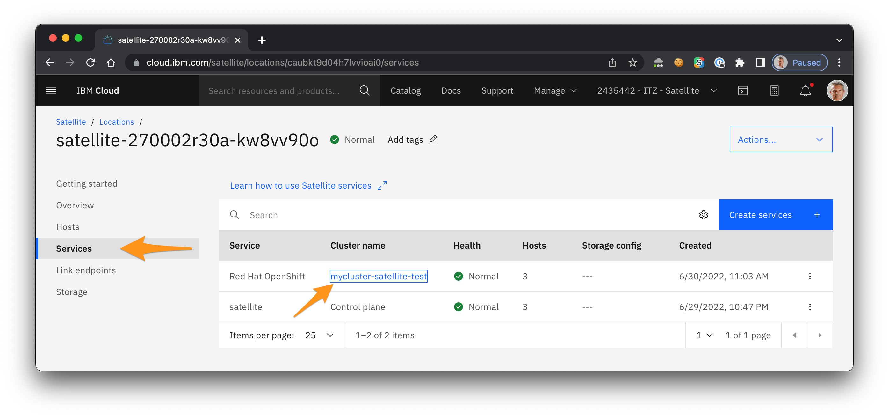

1. In the cluster, select the **Worker pools** menu. 

    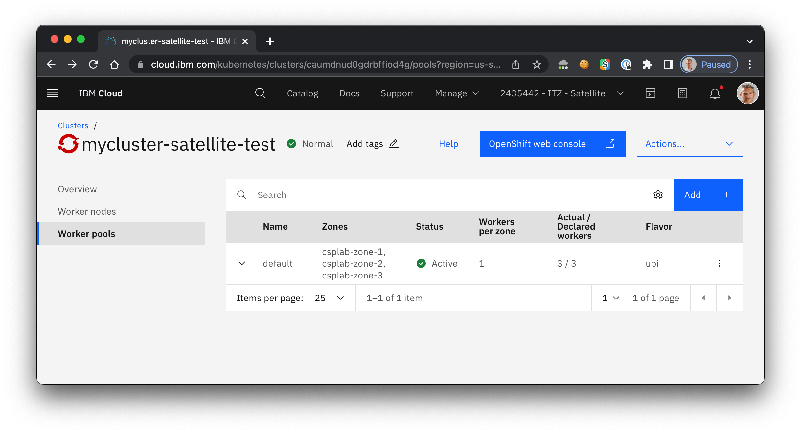

1. Click **Add** to create a new worker pool. Give a meaningful name to this pool such as `storage-pool`.

    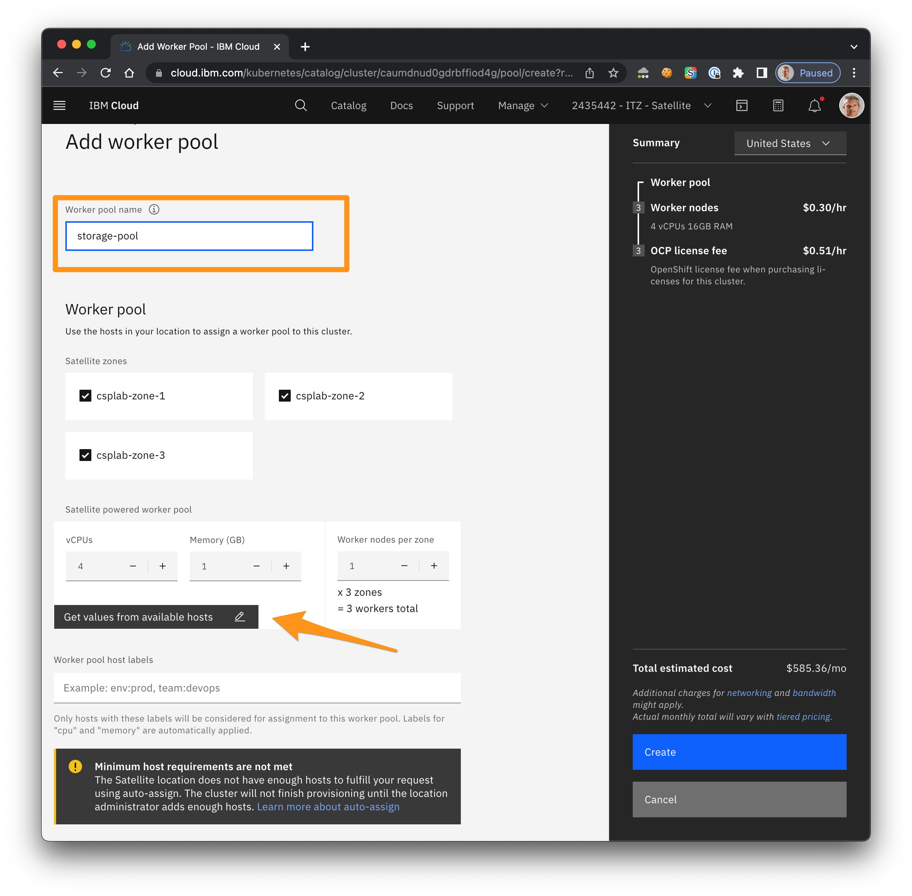

1. Click **Get values from available hosts** to match the 

    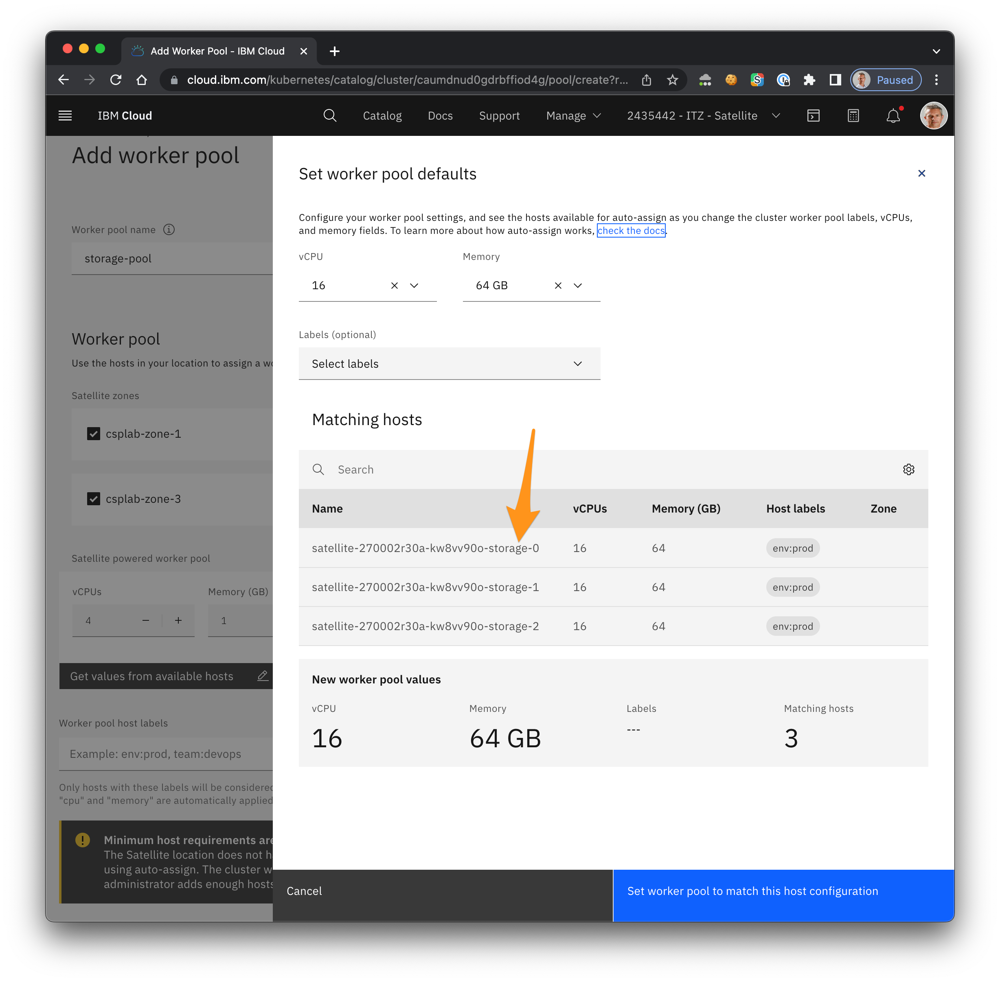

1. Validate by clicking **Set worker pool to match this host configuration**.

1. The warning `Minimum host requirements are not met` should have disappeared. Click **Create** pool.

1. Select **Worker nodes** menu to find out the status of the deployment.

    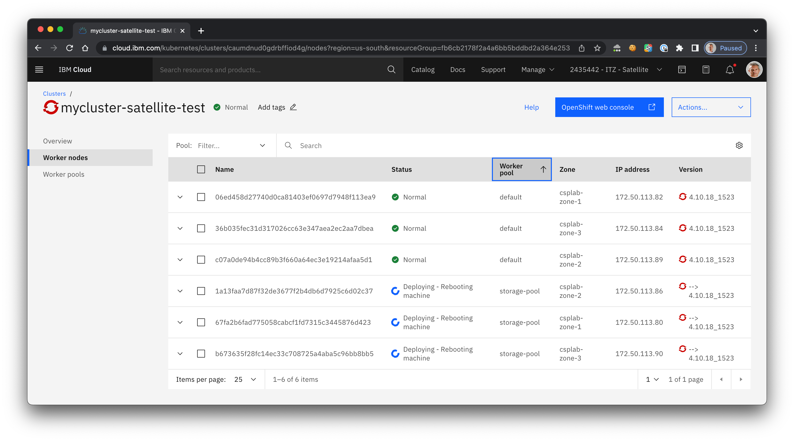

1. Write down the three storage worker names. You will need them in the next step.

> Deploying the new storage worker pools will take 30-40 minutes. You may see the error mesage `Critical - Not Ready` after a while. Wait a bit more and your worker pool will turn on `Normal`.

## Configure ODF for local devices storage configuration in Satellite

1. From the Satellite locations dashboard, select the location where you want to create a storage configuration.

1. Select Storage > Create storage configuration

    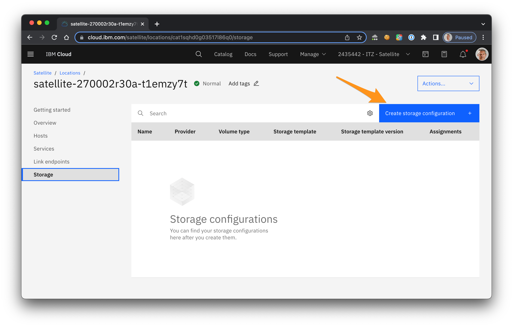

1. Enter a name such as`vmware-odf-storage` for your configuration. Select the Storage type **OpenShift Data Foundation for local devices** and the Version **4.9**. Then, click Next.

    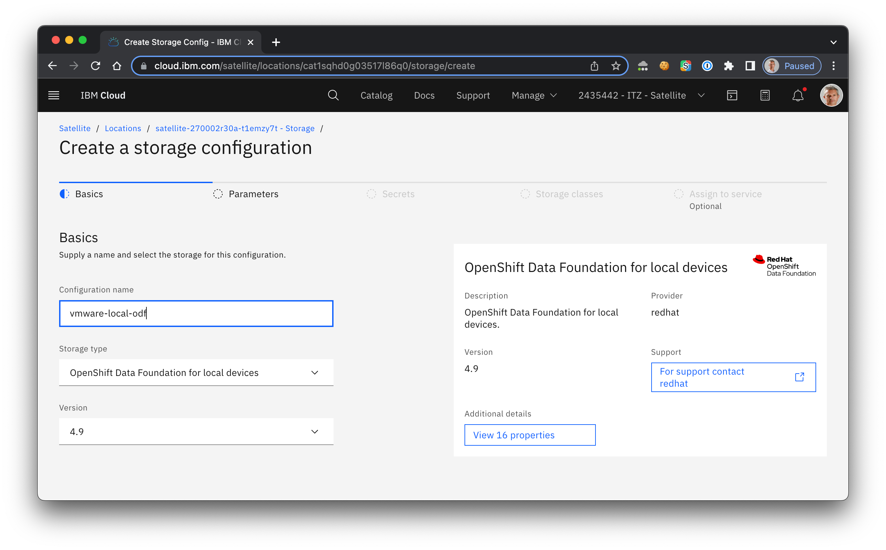  

1. In the Parameters tab, enter the 3 worker node names and then set the value **Automatic storage volume discovery** to true.

    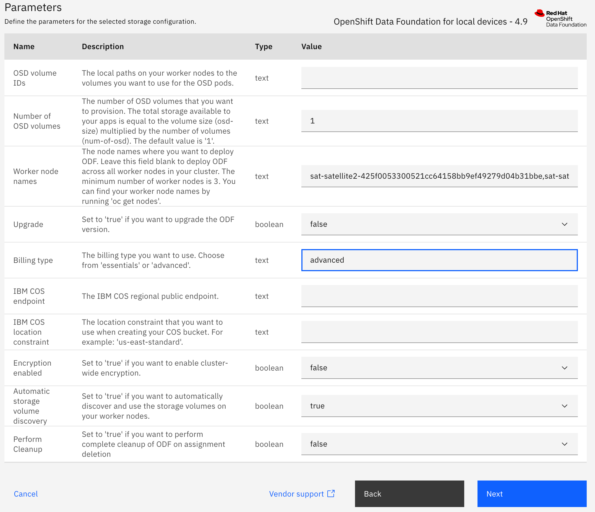

1. On the **Secrets** tab, leave both the Access key ID and Secret access key empty. Enter your IAM API key.

    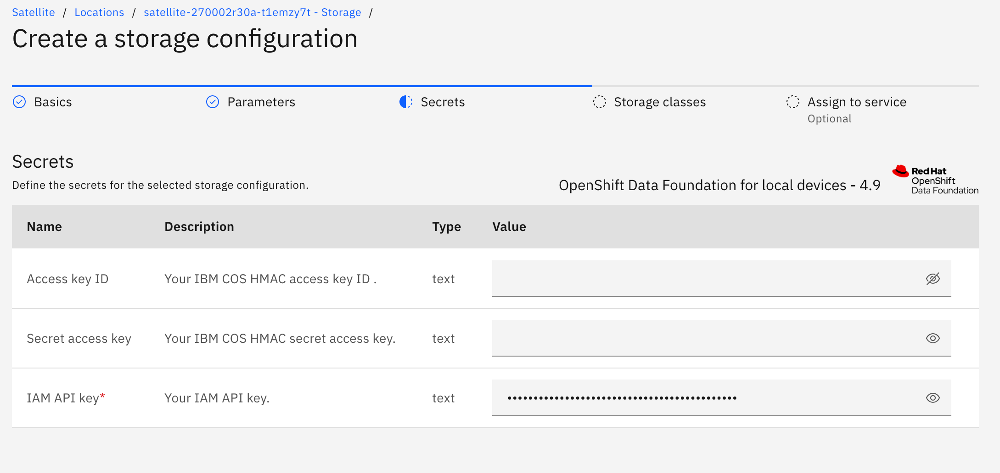

1. On the **Storage classes** tab, review the storage classes that are deployed by the configuration.

    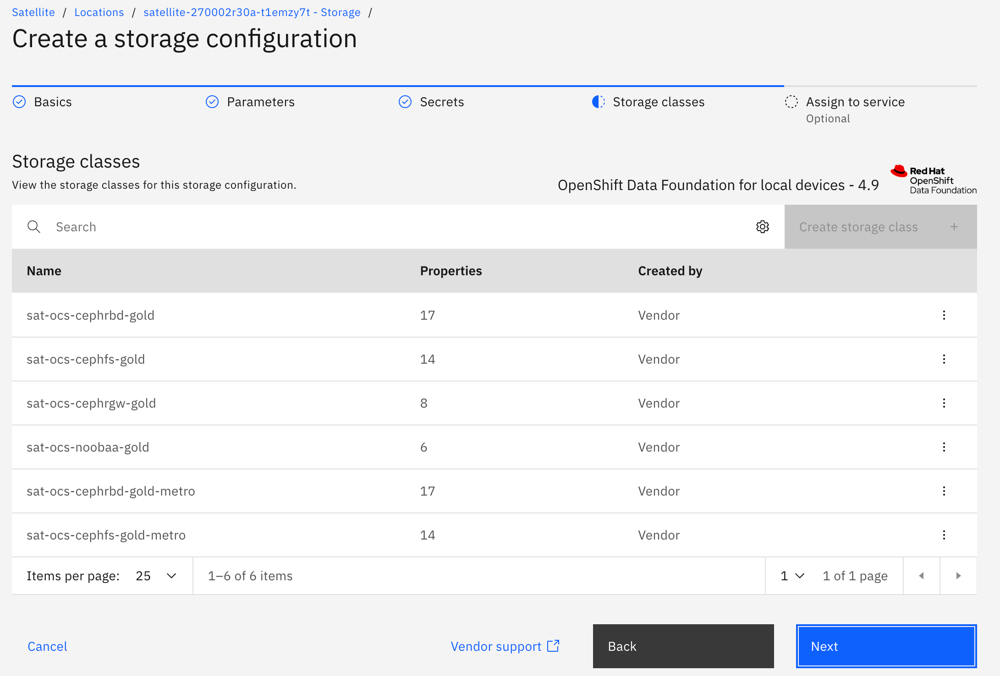

1. On the **Assign to service** tab, select your cluster that you want to assign your configuration to.

    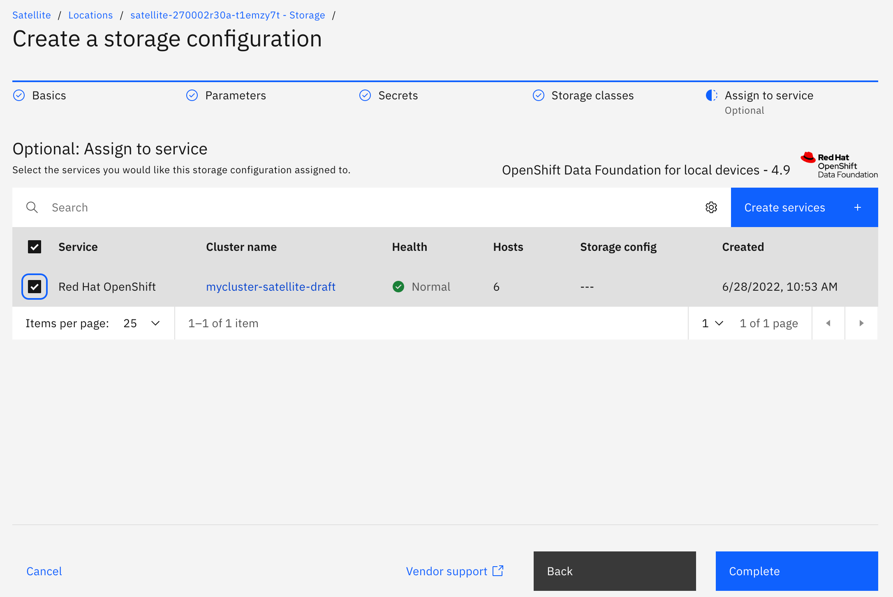

1. Click **Complete** to assign your storage configuration.

## Check the ODF deployment in your cluster

For more detailled descriptions of the following steps look also in the [Satellite Docs](https://cloud.ibm.com/docs/satellite?topic=satellite-config-storage-odf-local&interface=cli)

1. Connect to your Satellite Location through the [Cloud Shell](https://cloud.ibm.com/shell).

    ```sh
    ibmcloud target -g Satellite -r us-south
    ```

    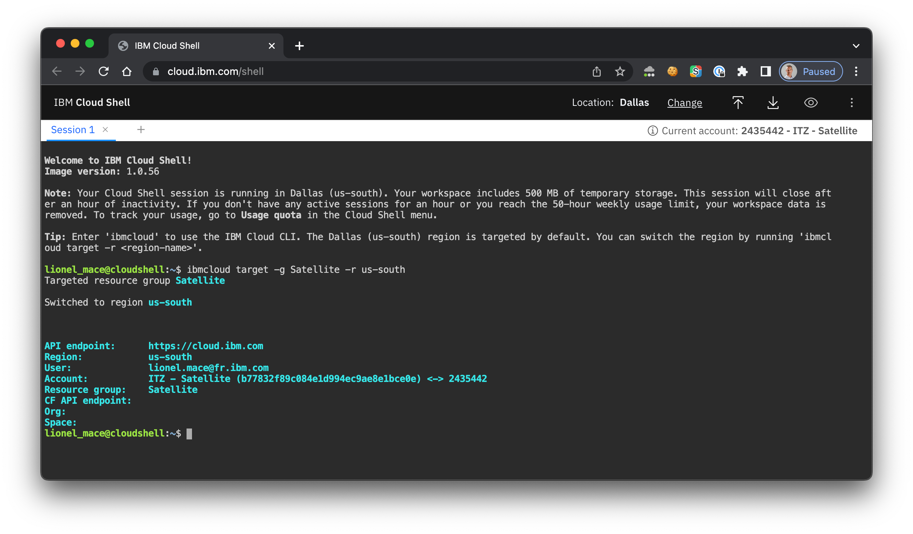

1. Verify that your cluster has a valid storage configuration has applied (from the previous chapter). Use the location id and cluster id ***NOT*** the name.

    ```sh
    ibmcloud sat location ls
    ibmcloud oc cluster ls --provider satellite
    ibmcloud sat storage assignment  ls --location <location_id> --cluster <cluster_id>
    ```

    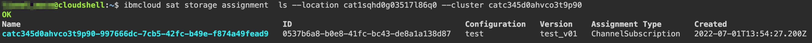

1. What you also will see that we already have Storage classes deployed, which could be used by ODF. Connect to your cluster and list the storage classes:

    ```sh
    # remove endpoint parameter if you connect via public IPs
    # use endpoint parameter if you connect from cloudshell
    ibmcloud ks cluster config -c <your cluster> --admin --endpoint link
    oc get storageclass
    ```

    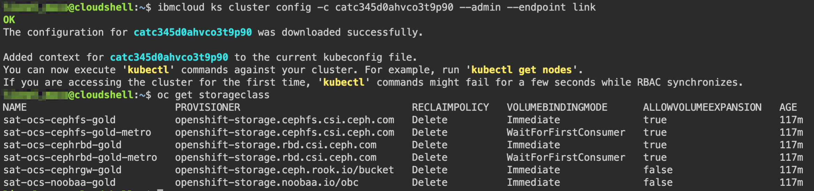  

## Issue

1. I don't see any namespace openshift-storage created.

    ```sh
    oc get storagecluster -n openshift-storage
    oc get pods -n openshift-storage
    ```

    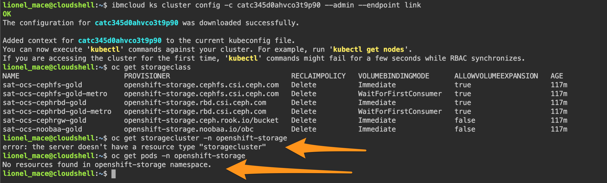