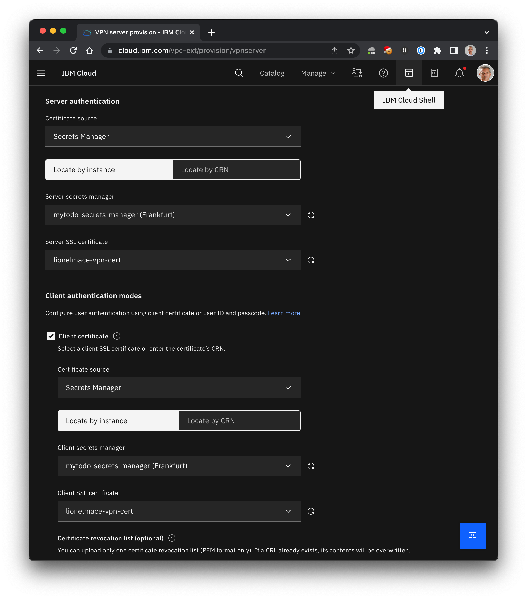
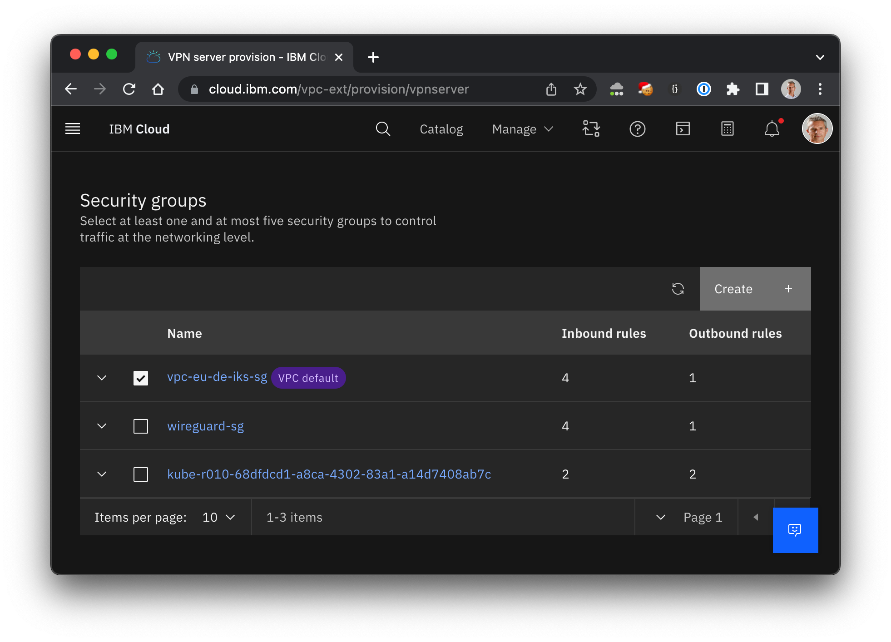

# VPN

The IBM Cloud VPN for VPC service supportes two types of connectivity:

* site-to-site connectivity, which connects your on-premises network to the IBM Cloud VPC network.

* client-to-site connectivity, which allows clients from the internet, such as a laptop, to connect to the VPC network while still maintaining secure connectivity.

The latter  is useful for telecommuters who want to connect to the IBM Cloud from a remote location, such as a home office. Let's set it up.


## Generate Certificates

1. Clone the Easy-RSA 3 repository into your local folder:

    ```sh
    git clone https://github.com/OpenVPN/easy-rsa.git
    cd easy-rsa/easyrsa3
    ```

1. Create a new PKI.

    ```sh
    ./easyrsa init-pki
    ```

    Output:

    ```
    You are about to remove the EASYRSA_PKI at:
    * /Users/lionelmace/Git/easy-rsa/easyrsa3/pki

    and initialize a fresh PKI here.

    Type the word 'yes' to continue, or any other input to abort.
    Confirm removal: yes


    Notice
    ------
    'init-pki' complete; you may now create a CA or requests.

    Your newly created PKI dir is:
    * /Users/lionelmace/Git/easy-rsa/easyrsa3/pki

    * Using Easy-RSA configuration:

    * IMPORTANT: Easy-RSA 'vars' template file has been created in your new PKI.
                Edit this 'vars' file to customise the settings for your PKI.
                To use a global vars file, use global option --vars=<YOUR_VARS>

    * Using x509-types directory: /Users/lionelmace/Git/easy-rsa/easyrsa3/x509-types
    ```

1. Create a new CA.

    ```sh
    ./easyrsa build-ca nopass
    ```

    Output:

    ```sh
    ...
    CA creation complete and you may now import and sign cert requests.
    Your new CA certificate file for publishing is at:
    /Users/lionelmace/Git/easy-rsa/easyrsa3/pki/ca.crt
    ```

1. Generate a VPN server certificate.

    ```sh
    ./easyrsa build-server-full vpn-server.vpn.ibm.com nopass
    ```

    Output

    ```sh
    ...
    Certificate created at: /Users/lionelmace/Git/easy-rsa/easyrsa3/pki/issued/vpn-server.vpn.ibm.com.crt
    ```

1. Generate a VPN client certificate.

    ```sh
    ./easyrsa build-client-full client1.vpn.ibm.com nopass
    ```

    Output

    ```sh
    ...
    Certificate created at: /Users/lionelmace/Git/easy-rsa/easyrsa3/pki/issued/client1.vpn.ibm.com.crt
    ```

## Import the certificates into Secrets Manager

You need an instance of the managed service [Secrets Manager](https://cloud.ibm.com/catalog/services/secrets-manager).

1. You can create the service from the UI or using the command line:

    ```sh
    ibmcloud resource service-instance-create <service-name> secrets-manager "trial" <region>
    ```

1. Import the certificates, click the button **Add +**, then **TLS Certificates** and finally **Import a certificate**

    

    Below are the inputs for each field:

    | Syntax | File |
    | ----------- | ----------- |
    | Certificate | easy-rsa/easyrsa3/pki/issued/vpn-server.vpn.ibm.com.crt |
    | Private Key (Optional) | easy-rsa/easyrsa3/pki/private/vpn-server.vpn.ibm.com.key |
    | Intermediate Security (Optional) | easy-rsa/easyrsa3/pki/ca.crt |

    

1. Click **Create**. You should get a confirmation like the following:

    

## Create a VPN

1. Create an **IAM Authorization** to authorize the service VPN to read certificates in the service Secrets Manager

    ```sh
    ibmcloud iam authorization-policy-create is secrets-manager SecretsReader --source-resource-type vpn-server
    ```

1. Go the [VPN Gateways](https://cloud.ibm.com/vpc-ext/network/vpnServers).

1. Click `Create`. Make sure to select `Client-to-site servers`.

    

1. Enter the **Details** values

    * VPN server name
    * Select a Resource Group
    * Select the Region such as Frankfurt
    * Select the VPC
    * Client IPv4 address pool: `192.168.4.0/22`
        > This range must be different from your local range and IBM Cloud IP ranges.

    

1. Enter the **Subnets** values

    * Select either **High-availability mode** (two subnets) or **Stand-alone mode** (one subnet).

    

1. Enter the **Authentication** values

    * For the certificate source, select **Secrets Manager**.
    * Locate the instance you created earlier.
    * Make sure to select the correct certificate from the list.
    * Redo those steps for the client certificate.

    

1. Enter the **Security Group** values

    * Select the Security Groups and potentialy the one created by IKS.

    

1. Enter the **Additional Configuration** values

    * Set the Transport protocol `UDP` and `VPN port` 443. You will add an inbound rule with those values in the VPC Security Group later.

    * Make sure to select the `Split Tunnel` for the Tunnel mode
        > Split tunnel: Private traffic flows through the VPN interface to the VPN tunnel, and public traffic flows through the existing LAN interface.

    

1. Create VPN Server. It will take a few minutes for your VPN to become Stable.

    

## Install and Configure a local VPN

We'll use Tunnelblick as a local VPN.

1. Install Tunnelblick from the [Downloads](https://tunnelblick.net/downloads.html).

1. Download client profile from the VPN you created. You should have a .ovpn file.

    

1. Edit the .ovpn file.

1. Uncomment the following lines

    ```
    # Uncomment the next two lines if certificate-based client authentication is enabled.
    #  Ask your VPN administrator provides your client certificate and replace client_public_key
    #  with your client certificate filename.
    #cert client_public_key.crt
    #key client_private_key.key
    ```

1. Update the last two lines to reflect you client public and private keys. For example, I added the following lines

    ```sh
    cert ./pki/issued/client1.vpn.ibm.com.crt
    key ./pki/private/client1.vpn.ibm.com.key
    ```

1. Import the modified .ovpn in the Configurations panel of Tunnelblick.

1. Click `Connect`. You should see a `Connected` confirmation message

    

1. TODO Add a screenshot of the connected in VPN

## Test

1. TODO: Let's create a VSI and ping the private IP address.

## Errors

1. TLS Error: TLS handshake failed

    ```sh
    2022-09-07 15:39:15.949622 TLS Error: TLS key negotiation failed to occur within 60 seconds (check your network connectivity)
    2022-09-07 15:39:15.949726 TLS Error: TLS handshake failed
    ```

    > Make sure to update your VPC Security Groups.

## Resources

    * [Full documentation](https://cloud.ibm.com/docs/vpc?topic=vpc-vpn-client-to-site-overview)

## Contributors

Thank you to [Vann Lam](https://github.com/vannlam) for testing the full workflow and the certificates generation.
