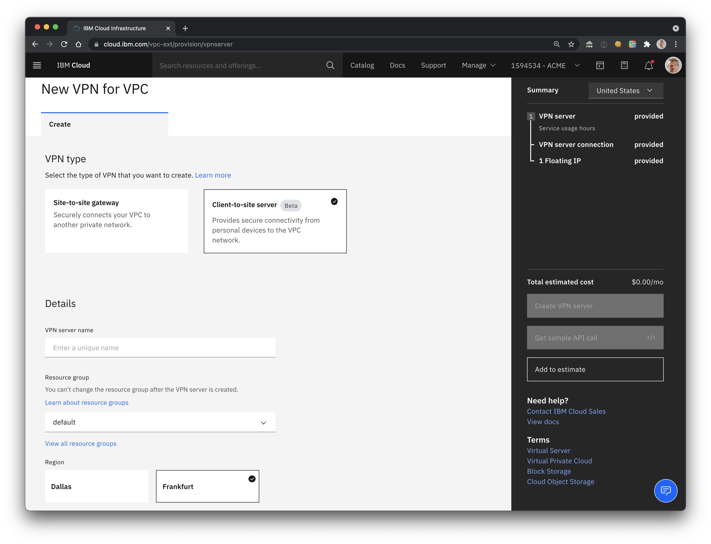
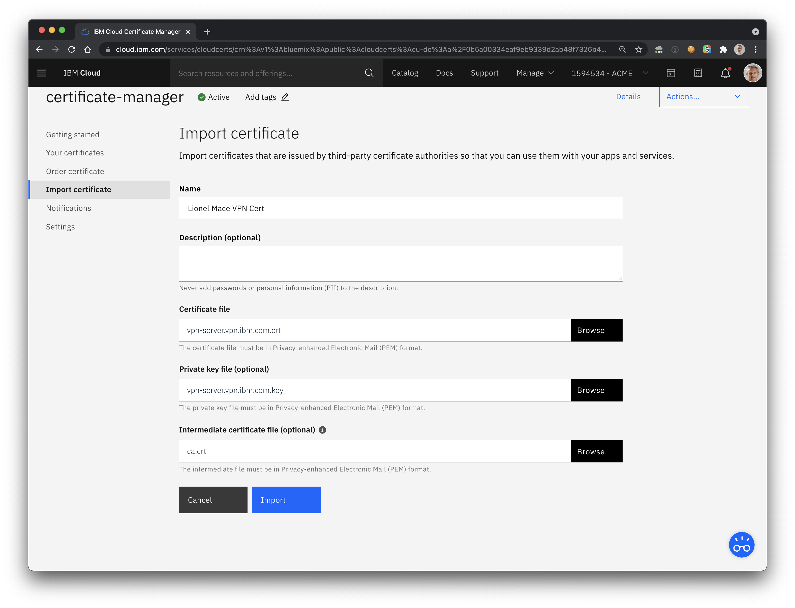
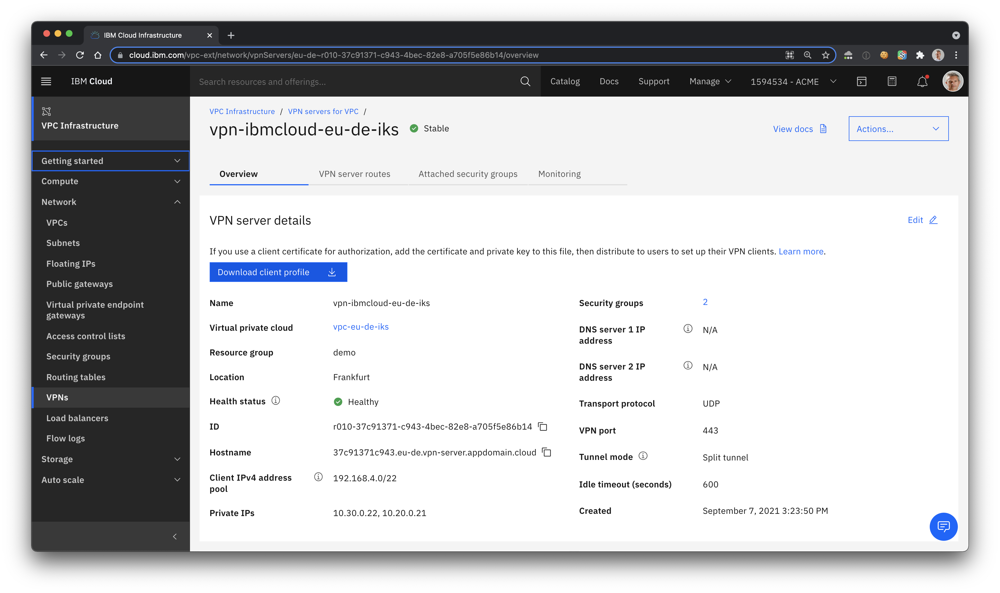

# VPN

Until now, the IBM Cloud VPN for VPC service supported only site-to-site connectivity, which connects your on-premises network to the IBM Cloud VPC network.

This beta release adds client-to-site connectivity, which allows clients from the internet, such as a laptop, to connect to the VPC network while still maintaining secure connectivity.

This solution is useful for telecommuters who want to connect to the IBM Cloud from a remote location, such as a home office.

[Full documentation](https://cloud.ibm.com/docs/vpc?topic=vpc-vpn-client-to-site-overview)



## Generate Certificates

1. Clone the Easy-RSA 3 repository into your local folder:

    ```sh
    git clone https://github.com/OpenVPN/easy-rsa.git
    cd easy-rsa/easyrsa3
    ```

1. Create a new PKI and CA:

    ```sh
    ./easyrsa init-pki
    ./easyrsa build-ca nopass
    ```

1. Generate a VPN server certificate.

    ```sh
    ./easyrsa build-server-full vpn-server.vpn.ibm.com nopass
    ```

1. Generate a VPN client certificate.

    ```sh
    ./easyrsa build-client-full client1.vpn.ibm.com nopass
    ```

## Import the certificates into Certificate Manager

You need an instance of the managed service [Certificate Manager](https://cloud.ibm.com/catalog/services/certificate-manager).

1. You can create the service from the UI or using the command line:

    ```sh
    ibmcloud resource service-instance-create <service-name> cloudcerts "free" <region>
    ```

1. Import the certificates into this instance

    

## Create a VPN

1. Create an IAM service-to-service authorization to authorize VPN to read certificates in Certificate Manager

    ```sh
    ibmcloud iam authorization-policy-create is cloudcerts Writer --source-resource-type vpn-server
    ```

1. Go the [VPN Gateways](https://cloud.ibm.com/vpc-ext/network/vpnServers).

1. Click `Create`. Make sure to select `Client-tp-site server` currently in Beta.

    

1. Enter the following values

    * VPN server name
    * Select a Resource Group
    * Select the Region such as Frankfurt
    * Select the VPC
    * Client IPv4 address pool: `192.168.4.0/22`
        > This range must be different from your local range and IBM Cloud IP ranges.
    * Select either high-availability (two subnets) or stand-alone (one subnet) mode.
    * Configure the client authentication with the `Client certificate` option and make sure to select the correct certificate from the list.
    * Select the Security Groups and potentialy the one created by IKS.
    * Keep the default for Additional Configuration.
    * Make sure to select the `Split Tunnel` for the Tunnel mode
        > Split tunnel: Private traffic flows through the VPN interface to the VPN tunnel, and public traffic flows through the existing LAN interface.

1. Note the Transport protocol `UDP` and `VPN port` 443. You will add an inbound rule with those values in the VPC Security Group later.

1. Click `Download client profile` from the VPN you created to get the generated .ovpn file.

    

## Install and Configure a local VPN

We'll use Tunnelblick as a local VPN.

1. Install Tunnelblick from the [Downloads](https://tunnelblick.net/downloads.html).

1. Download client profile from the VPN you created. You should have a .ovpn file.

1. Edit the .ovpn file and update the last two lines to reflect you client public and private keys. For example, I added the following lines

    ```sh
    cert ./pki/issued/client1.vpn.ibm.com.crt
    key ./pki/private/client1.vpn.ibm.com.key
    ```

1. Import the modified .ovpn in the Configurations panel of Tunnelblick.

1. Click `Connect`. You should see a `Connected` confirmation message

    

## Errors

1. TLS Error: TLS handshake failed

    ```sh
    2021-09-07 15:39:15.949622 TLS Error: TLS key negotiation failed to occur within 60 seconds (check your network connectivity)
    2021-09-07 15:39:15.949726 TLS Error: TLS handshake failed
    ```

    > Make sure to update your VPC Security Groups.

## Contributors

Thank you to [Vann Lam](https://github.com/vannlam) for testing the full workflow and the certificates generation.
