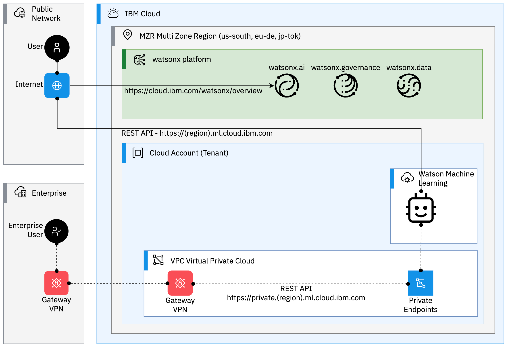

# How secure is IBM watsonx running on IBM Cloud?

> 15 mins read

The short answer could be: The IBM watsonx platform is very secure and resilient...
I have been building mission-critial cloud architecture for the past 8 years and I can tell you clients and partners expect much more...
* How does IBM secure my data?
* Where are the foundation models hosted?
* Can I call a private watsonx API?
* How do I segregate data?

That's just a few questions I have been responding so far. As there is a huge demand to use watsonx at the Enterprise level, I thought I would address some of the key security concerns when embracing generative AI on IBM Cloud.

## Where are the training models hosted?

IBM watsonx is deployed on the IBM Cloud multi-zone region network. The availability of services and features can vary across regional data centers.

watsonx.ai includes the Watson Studio and Watson Machine Learning services to provide foundation and machine learning model tools.

The Watson Studio and Watson Machine Learning services are available in the following regional data centers:

* Dallas (us-south), in Texas US
* Frankfurt (eu-de), in Germany
* Tokyo (jp-tok), in Japan

Source: https://dataplatform.cloud.ibm.com/docs/content/wsj/getting-started/regional-datactr.html?context=wx&audience=wdp

## What are the network security mechanisms available to secure watsonx?

IBM watsonx provides network security mechanisms to protect infrastructure, data, and applications from potential threats and unauthorized access. Network security mechanisms provide secure connections to data sources and control traffic across both the public internet and internal networks.

Source: https://dataplatform.cloud.ibm.com/docs/content/wsj/getting-started/security-network.html?context=wx&audience=wdp

You can use private network endpoints to connect to your IBM Watson Machine Learning service instance over the IBM Cloud Private network. After you configure your Watson Machine Learning service to use private endpoints, the service is not accessible from the public internet.

Source: https://dataplatform.cloud.ibm.com/docs/content/wsj/analyze-data/ml-service-endpoint.html?context=cpdaas&audience=wdp

## Who has access to the data from IBM?

IBM Cloud allows organizations to choose the geographic location where their data is stored and processed, helping them comply with data residency and sovereignty requirements.

Clients control whether prompts, model choices, and prompt engineering parameter settings are saved. When saved, your data is stored in a dedicated IBM Cloud Object Storage bucket that is associated with your watsonx project.

Source: https://dataplatform.cloud.ibm.com/docs/content/wsj/analyze-data/fm-security.html?context=wx

## How does IBM Cloud handle data being shared with watsonx platform?

Data is stored in a dedicated IBM Cloud Object Storage bucket that is associated with your watsonx project.

Source: https://dataplatform.cloud.ibm.com/docs/content/wsj/analyze-data/fm-security.html?context=wx

IBM generally does not have access to Content.
More details in the Data Processing and Protection Datasheet.

Source: https://www.ibm.com/software/reports/compatibility/clarity-reports/report/html/softwareReqsForProduct?deliverableId=52EF8B204FEC11ED97548910D8A210BE

## How does IBM Cloud secure the data that is shared with the watsonx platform?

IBM Cloud employs encryption techniques to protect data both in transit and at rest. This ensures that data remains secure even if intercepted during transmission or stored on servers.

In IBM watsonx, data security mechanisms, such as encryption, protect sensitive customer and corporate data, both in transit and at rest. A secure , and other mechanisms protect your valuable corporate data. A secure IBM Cloud Object Storage instance stores data assets from projects, catalogs, and deployment spaces.

Source: https://dataplatform.cloud.ibm.com/docs/content/wsj/getting-started/security-data.html?context=wx&audience=wdp

Context Based Restrictions (CBR) can be configured to prevent any access to object storage data unless the request originates from a trusted network zone. CBR enables you to configure inbound firewall rules to allow IBM watsonx access to private data sources stored in Cloud Object Storage. The public and private IP addresses for the IBM watsonx cluster can be retrieved in the Firewall Configuration of watsonx administration page.

Source: https://dataplatform.cloud.ibm.com/docs/content/wsj/admin/firewall-cfg-private-cos.html?context=wx&audience=wdp

## Is the environment dedicated infrastructure or shared?

Calling a Foundation Model to generate output in response to a prompt is known as inferencing. Foundation model inferencing is measure in resource units (RU). Each RU equals 1,000 tokens. A token is a basic unit of text (typically 4 characters or 0.75 words) used in the input or output for a foundation model prompt.

Source: https://eu-de.dataplatform.cloud.ibm.com/docs/content/wsj/admin/monitor-resources.html?context=wx&audience=wdp

WML (Watson Machine Learning) resources (measured in RU Resource Units) is used when you run inferencing services with foundation models.  The service instance of WML is dedicated to the client. WML provides access to shared compute resources.Watson Machine Learning plans govern how you are billed for models you train and deploy with Watson Machine Learning and for prompts you use with foundation models. Choose a plan based on your needs:

Essentials is a pay-as-you-go plan that gives you the flexibility to build, deploy, and manage models to match your needs.

Standard is a high-capacity enterprise plan that is designed to support all of an organization's machine learning needs. Capacity unit hours are provided at a flat rate, while resource unit consumption is pay-as-you-go.

Source: https://dataplatform.cloud.ibm.com/docs/content/wsj/getting-started/wml-plans.html?context=cpdaas&audience=wdp

## How does IBM Cloud segregate the clients using the watsonx platform ?

Security mechanisms in IBM watsonx provide protection for data, applications, identity, and resources. In order to segregate the clients, you can configure security mechanisms on five levels for IBM Cloud security functions

* Network Security
* Enterprise Security
* Account Security
* Data Security
* Collaborator Security.

Source: https://dataplatform.cloud.ibm.com/docs/content/wsj/getting-started/security-overview.html?context=wx&audience=wdp