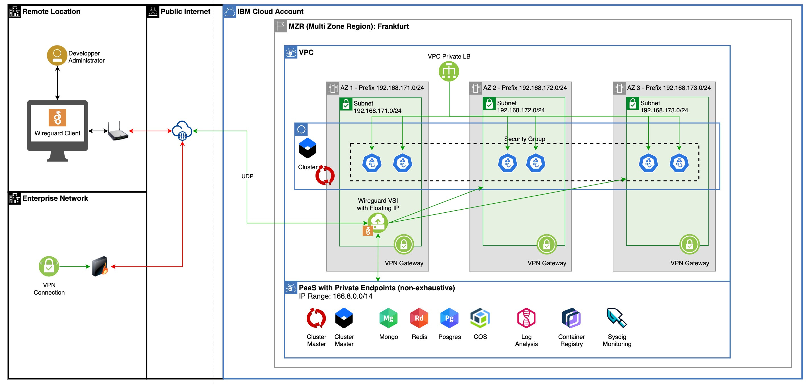
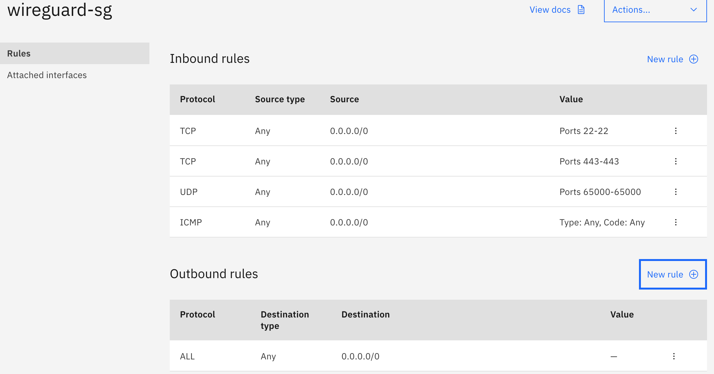
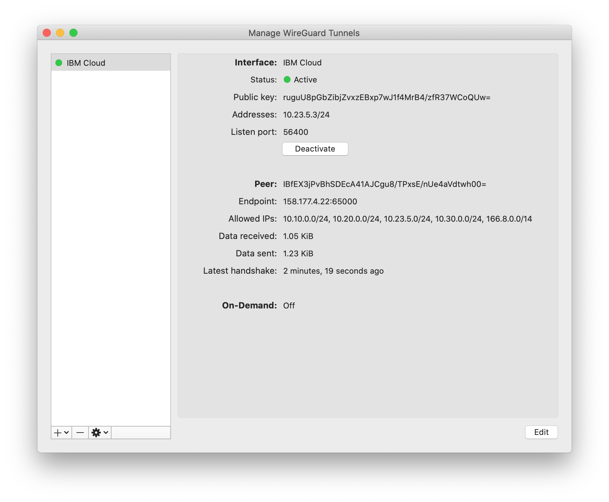

# Connect IBM Cloud by VPN using Wireguard



## Install Wireguard

1. On Mac, you can download it from the [App Store](https://apps.apple.com/fr/app/wireguard/id1451685025?l=en&mt=12)

## Create a Security Group

1. Create the following Security Group




## Provision a VSI in VPC

1. Create a SSH key
    ```
    ssh-keygen -t rsa -b 4096 -C “wireguard” -f ~/.ssh/key-wireguard
    ```

1. Create a VSI name `vsi-wireguard`, zone `fra-01`, image `ubuntu-18.04`, compute `cx2-2x4`

1. Associate this VSI with the Security Group previously created.

1. Create a public Floating IP and save it for later. 

1. Test the connectin via ssh
    ```
    ssh -i ~/.ssh/key-wireguard root@IP-ADDRESS
    ```

## Install Wireguard on VSI

1. Add the Wireguard repository to your sources list. Apt will then automatically update the package cache.
    ```
    sudo add-apt-repository ppa:wireguard/wireguard
    ```

1. Install Wireguard. The wireguard package will install all necessary dependencies.
    ```
    sudo apt install wireguard
    ```

1. Install Wireguard DKMS Module
    ```
    apt-get install wireguard-dkms wireguard-tools linux-headers-$(uname -r)
    ```

## Configure WireGuard Server

1. Generate a private and public key pair for the WireGuard **server**
    ```
    umask 077
    wg genkey | tee wg_server_private_key | wg pubkey > wg_server_public_key
    ```

1. Generate a private and public key pair for the WireGuard **client**
    ```
    wg genkey | tee wg_client_private_key | wg pubkey > wg_client_public_key
    ```

1. Create the file /etc/wireguard/wg0.conf and add the contents indicated below. You’ll need to enter your server’s private key in the PrivateKey field, and its IP addresses in the Address field.

    ```
    [Interface]
    Address = 10.23.5.1/24
    SaveConfig = false

    PostUp = iptables -A FORWARD -i %i -j ACCEPT; iptables -t nat -A POSTROUTING -o ens3 -j MASQUERADE
    PostDown = iptables -D FORWARD -i %i -j ACCEPT; iptables -t nat -D POSTROUTING -o ens3 -j MASQUERADE
    
    ListenPort = 65000
    PrivateKey = <wg_server_private_key>

    [Peer]
    PublicKey = <wg_client_public_key>
    AllowedIPs = 10.23.5.3/32
    ```

## Active IP Forwarding

1. Edit `sysctl.conf`file
    ```
    vi /etc/sysctl.conf
    ```

1. Uncomment line
    ```
    net.ipv4.ip_forward = 1
    ```

1. Apply changes
    ```
    sysctl -p
    ```

## Start the Wireguard Service

1. Start Wireguard
    ```
    wg-quick up wg0
    ```

1. Enable the Wireguard service to automatically restart on boot
    ```
    sudo systemctl enable wg-quick@wg0
    ```

1. Check if the VPN tunnel is running with the following two commands:
    ```
    sudo wg show
    ```
    You should see a similar output:
    ```
    root@vsi-wireguard:~# sudo wg show
    interface: wg0
    public key: xFQeWCn1j/MHIDizWsCJcvTrHpzMdtxLh5j6Pog8U3I=
    private key: (hidden)
    listening port: 65000
    ```


## Wireguard Client

1. Create the configuration file and add the contents indicated below. You’ll need to enter its IP addresses in the Address field.

    ```
    [Interface]
    PrivateKey = <wg_client_private_key>
    Address = 10.23.5.3/24
    
    [Peer]
    PublicKey = <wg_server_public_key>
    AllowedIPs = 10.10.0.0/24, 10.20.0.0/24, 10.30.0.0/24, 10.23.5.0/24, 166.8.0.0/14
    Endpoint = <wireguard-vsi-public-floating-ip>:65000
    ```
    AllowedIPs includes
    * 3 VPC subnets IP ranges: 10.10.0.0/24, 10.20.0.0/24, 10.30.0.0/24
    * Wireguard range: 10.23.5.0/24
    * IBM Cloud Service Endpoint (CSE): 166.8.0.0/14

1. Activate VPN

    

## Test your tunnel

1. Make sure there is some data transferred by running one of this command:
    ```
    sudo wg show wg0 latest-handshakes
    ruguU8pGbZibjZvxzEBxp7wJ1f4MrB4/zfR37WCoQUw=	1594914544
    ```
    ```
    sudo wg show wg0 transfer
    ruguU8pGbZibjZvxzEBxp7wJ1f4MrB4/zfR37WCoQUw=	692	604
    ```

1. From your local machine, ping the private IP of the Wireguard VSI address
    ```
    ping 10.23.5.1
    ```

1. From your local machine, ping the private endpoint of one of your [Kubernetes cluster](https://cloud.ibm.com/kubernetes/clusters) such as
    ```
    ping c2.private.eu-de.containers.cloud.ibm.com
    ```

## Resources
* [set-up-wireguard-vpn-on-ubuntu](https://www.linode.com/docs/networking/vpn/set-up-wireguard-vpn-on-ubuntu/)