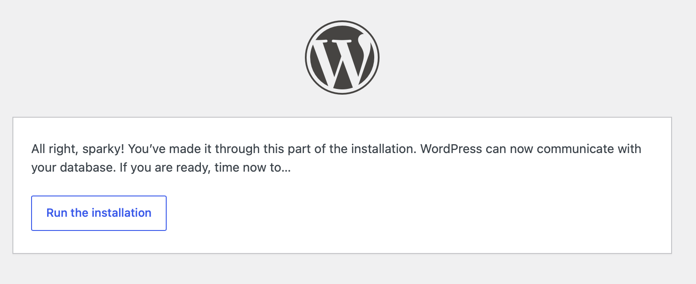
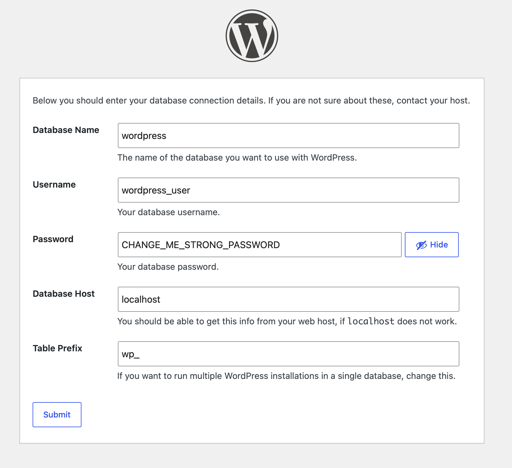
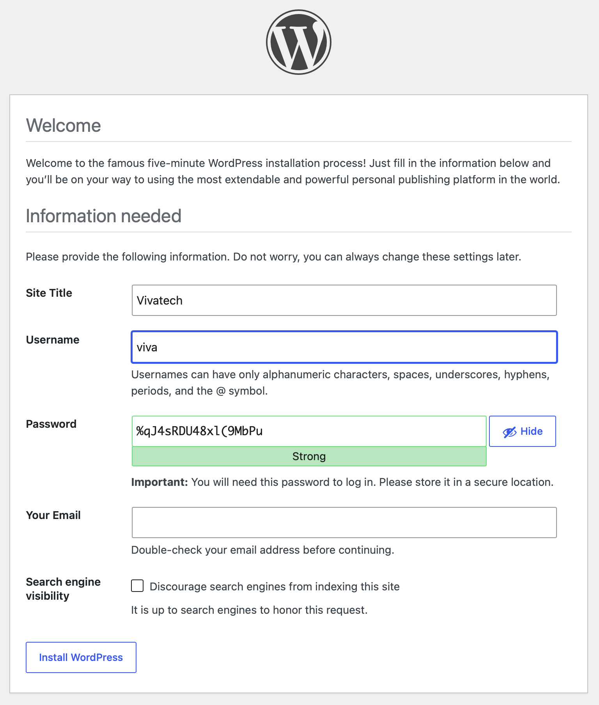
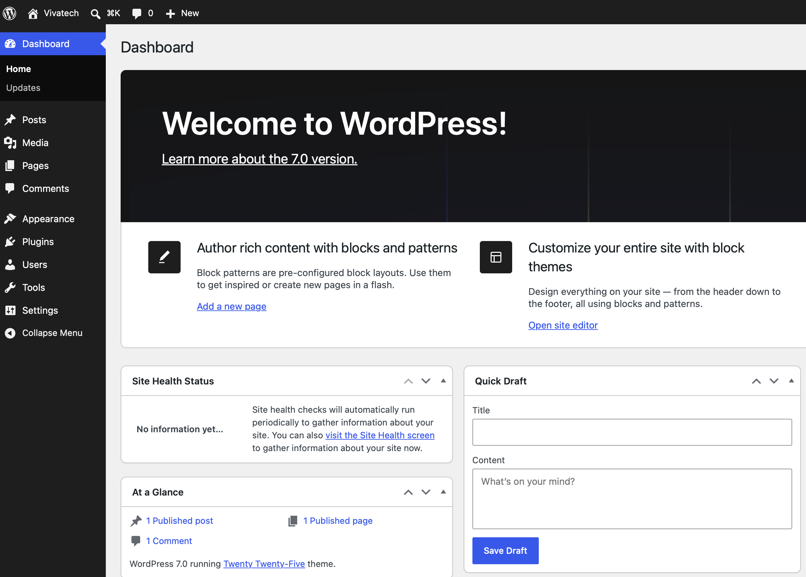

1. Create a VSI/VM with a public IP and a SSH Key

1. Copy the Wordpress installation script on this VM

    ```sh
    scp -i ~/.ssh/id_rsa ./wordpress-centos.sh vpcuser@<your-public-ip>:/tmp
    ```

    > Username is vpcuser for IBM Cloud VPC VSI. Change it for your infra.

1. SSH into the machine

    ```sh
    ssh -i ~/.ssh/id_rsa vpcuser@<your-public-ip>
    ```

1. Make the Wordpress install script executable

    ```sh
    chmod +x wordpress-centos.sh
    ```

1. Run the Wordpress install

    ```sh
    ./wordpress-centos.sh
    ```

    > Once installed, you should see:
    Relabeled /var/www/html/xmlrpc.php from unconfined_u:object_r:httpd_sys_content_t:s0 to unconfined_u:object_r:httpd_sys_rw_content_t:s0
    > Done. Open: http://your-public-ip/
    > Database: wordpress
    > User: wordpress_user
    > Password: CHANGE_ME_STRONG_PASSWORD

1. Connect to the portal by opening: http://your-public-ip/

1. Follow the installation process.

    
    
    
    
